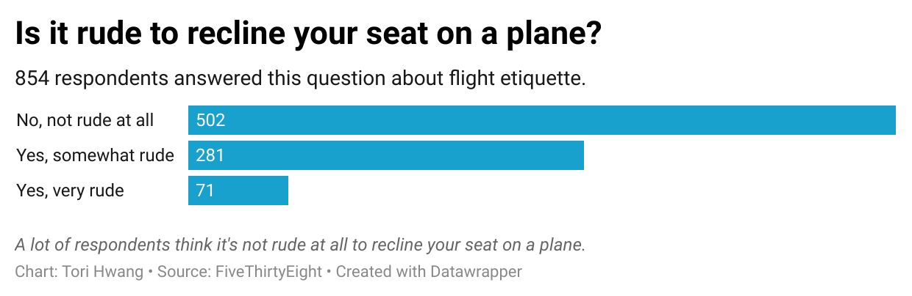

# Journalism 124 Week 4 Assignment

I chose this question because recently on all of my flights, I have been behind someone who reclines their seat. I didn't think much of it even as of last year, but my recent experiences have been so uncomfortable that I now firmly believe that it's a little rude to recline seats all the way back on a flight, **especially** if it's a long one. 

To my surprise, the chart below shows that a majority of respondents do not find it rude to recline their seats on a plane, given by the length of the bar referring to "No, not rude at all." 

